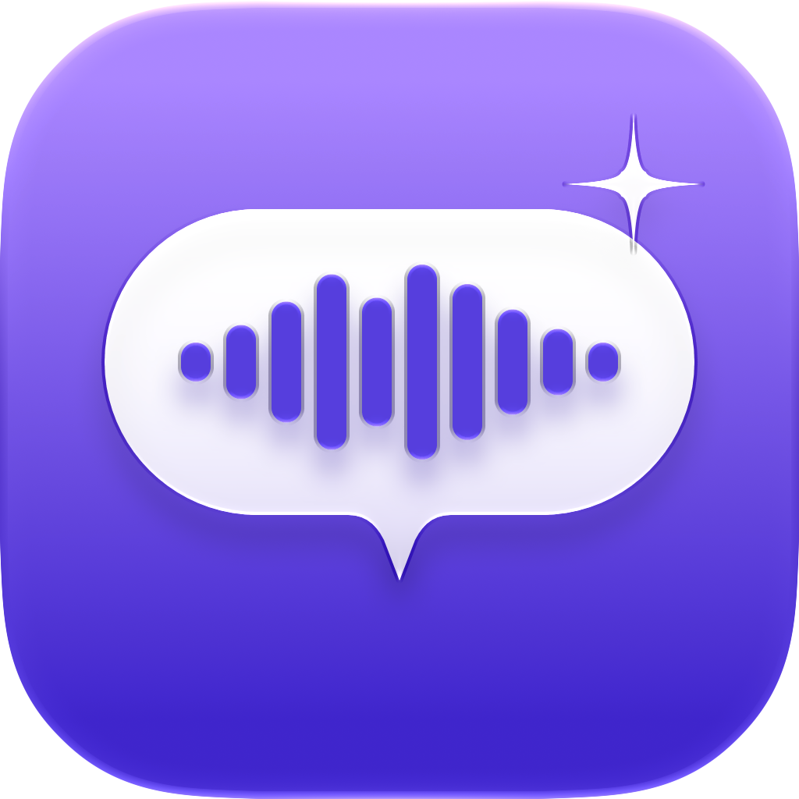

<h1 align="center">Utter</h1>

Hold <kbd>fn</kbd>, talk, let go. Your words are typed wherever your cursor is. 
Private and on-device: your voice never leaves your Mac.

<a href="https://github.com/sammystech/Utter/releases/latest/download/Utter.dmg"><b>⬇︎ Download Utter for Mac</b></a>

---

## What it does

- **Hold fn to dictate** in any app; double-tap fn for hands-free.
- **AI polish**: removes "um/uh", understands corrections ("apples, wait, peaches" → "peaches"),
  formats lists, numbers, emails and web addresses.
- **Type as I talk**: words appear while you speak (double-tap ⌃ to switch).
- **AI mode** (⌃ + fn): turns rambling into a short, complete prompt for ChatGPT or Claude.
- **Command Mode** (⌘ + fn): select text and say what to change.
- **Autocorrect while typing** in any app, with ⌫ to undo.
- Snippets, styles per app, a dictionary that learns, history with word stats, pauses your
  music while you talk.

## Install

1. Download **[Utter.dmg](https://github.com/sammystech/Utter/releases/latest/download/Utter.dmg)**,
   open it and drag Utter into Applications.
2. Open Utter and follow the short setup: Microphone, Accessibility, and the fn key.
3. Hold fn and talk.

Requires macOS 26 or later on Apple Silicon. Utter updates itself.

© 2026 Sammy Mittman. All rights reserved.
